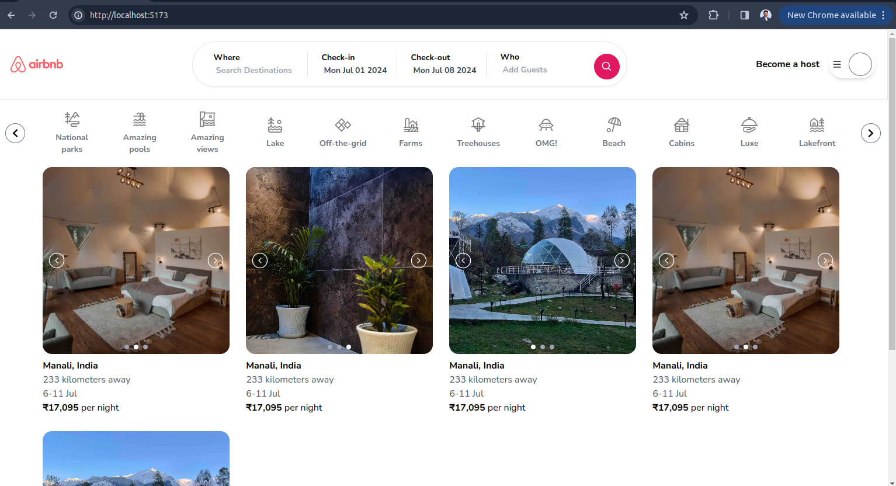
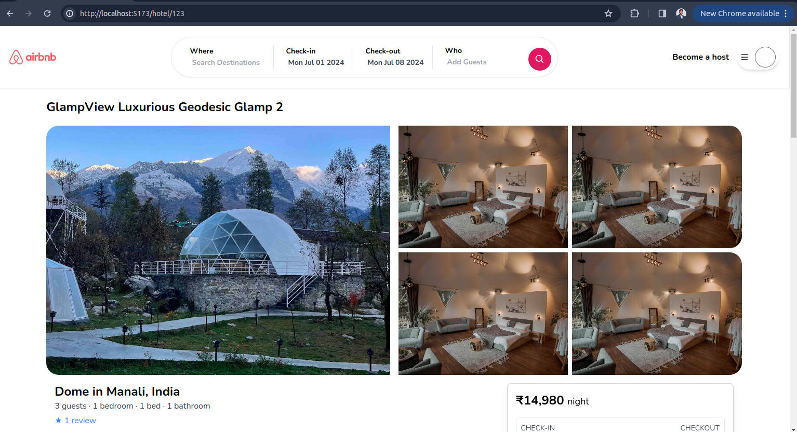

# Airbnb Clone

This project is an Airbnb clone built using React, TypeScript, and Tailwind CSS. It replicates the essential features of Airbnb's frontend design, including property listings, booking functionality, user reviews, and maps integration.

 # preview 

 
 
 
 
 

## Table of Contents

- [Features](#features)
- [Installation](#installation)
- [Usage](#usage)
- [Technologies](#technologies)
- [Contributing](#contributing)
- [License](#license)

## Features

- Property listing with details
- Booking functionality with date range picker
- User reviews and ratings
- Map integration using Leaflet.js
- Responsive design with Tailwind CSS

## Technologies
React
TypeScript
Tailwind CSS
Leaflet.js for map integration
React Date Range for date range picker
Date-fns for date manipulation